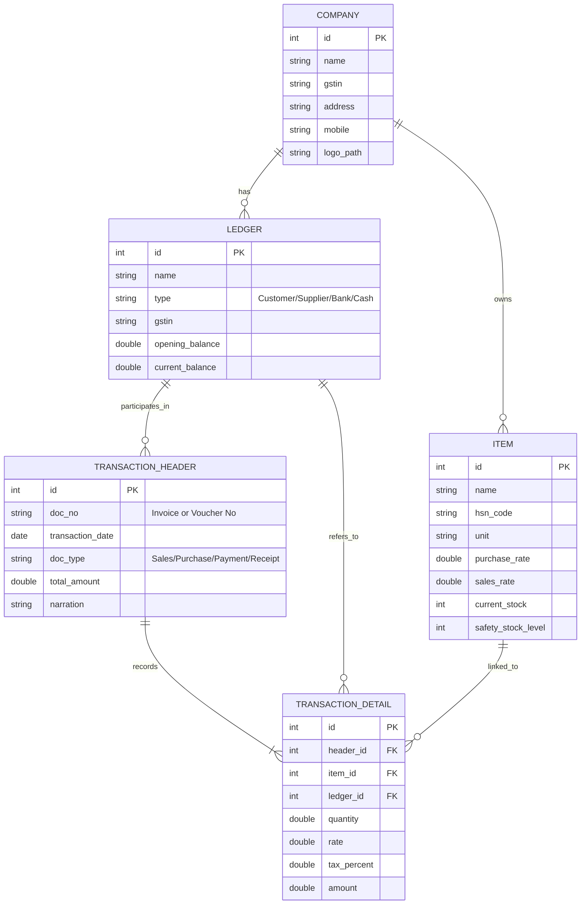
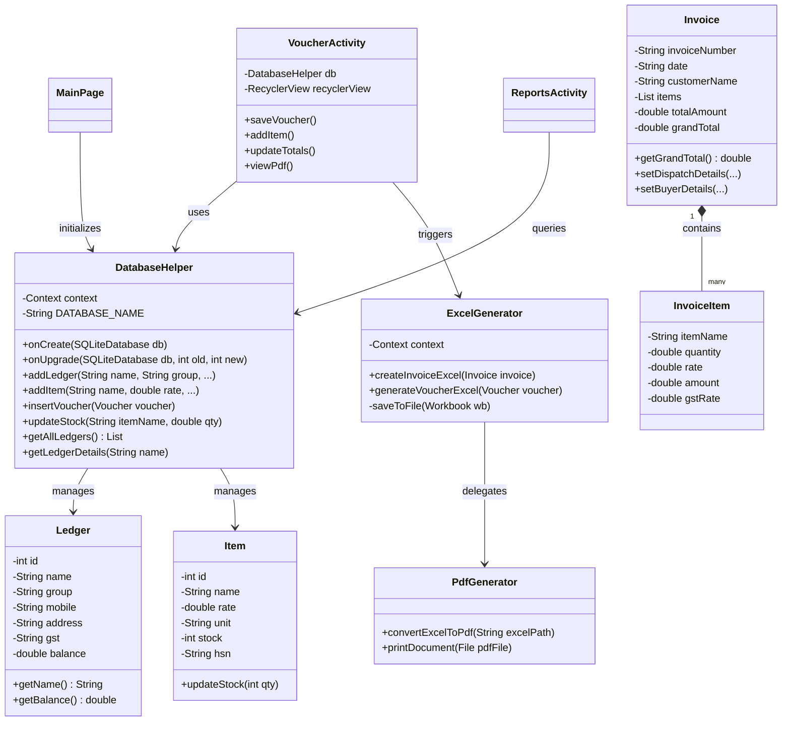
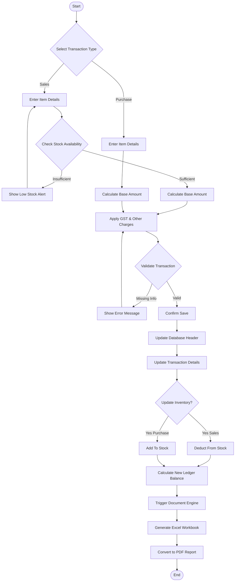
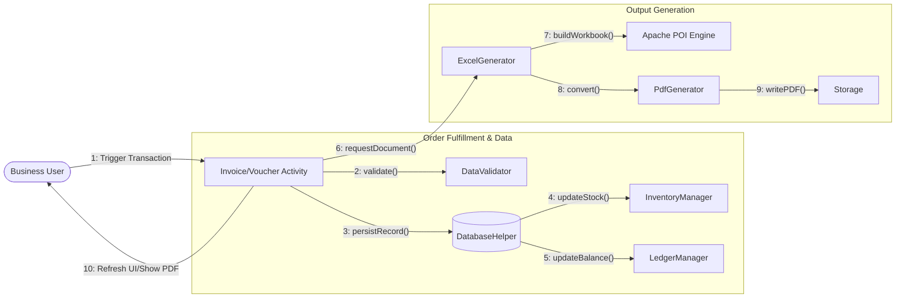
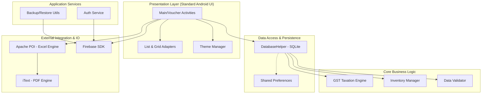
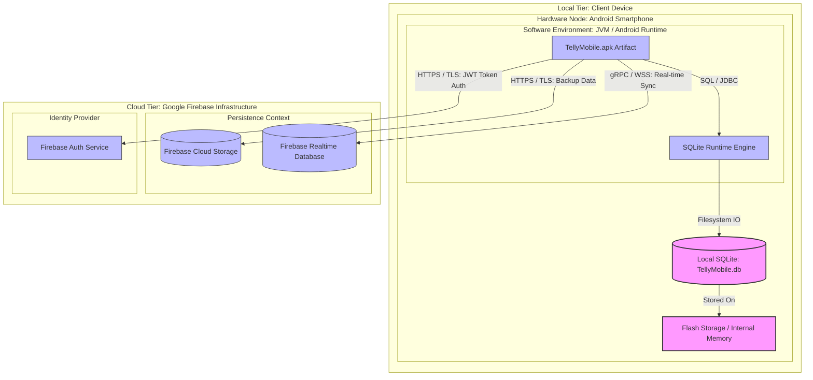
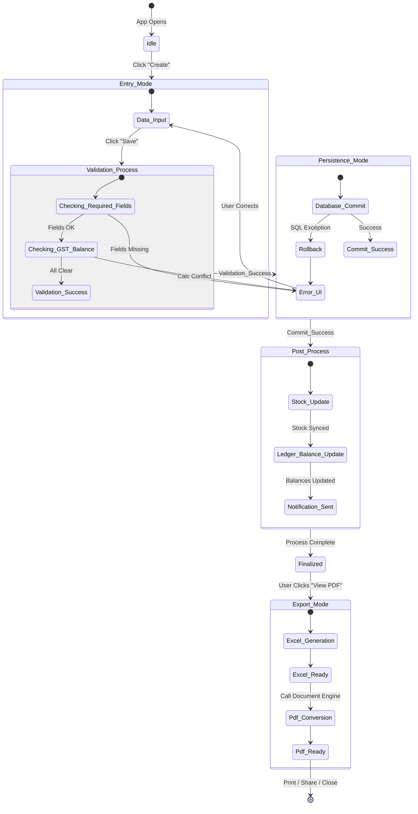

# Telly Mobile - Project Documentation

## Chapter 1: Introduction

### 1.1 Project Overview
Telly Mobile is an Android-based application developed to simplify business accounting and management for small and medium-scale enterprises. The main objective of the project is to create a mobile platform that enables users to efficiently handle their day-to-day business transactions such as sales, purchases, payments, and receipts in an easy and user-friendly manner.

The application serves as a comprehensive tool for entrepreneurs who require mobility and simplicity in managing their financial data, ensuring that business operations can be managed seamlessly from anywhere.

### 1.2 Background
Traditional accounting systems are often complex and require significant technical knowledge, creating a barrier for many small business owners. Telly Mobile aims to bridge this gap by providing a simplified and intuitive interface. 

By removing the complexity associated with conventional accounting software, Telly Mobile empowers users to record and track their credits and debits, generate GST-compliant bills, and maintain inventory without needing specialized training. This approach democratizes digital accounting, making it accessible to a broader range of users.

### 1.3 Objectives
The primary objectives of the Telly Mobile project are:
*   **Simplification**: To provide an easy-to-use mobile platform for managing daily financial transactions.
*   **Accessibility**: To make digital accounting accessible to users with minimal technical knowledge.
*   **Efficiency**: To streamline processes such as sales, purchases, and inventory management.
*   **Accuracy**: To ensure complete accuracy in financial records through automated GST calculations and ledger management.
*   **Mobility**: To offer a convenient solution for managing business operations from anywhere.
*   **Security**: To ensure data security through local storage and backup options.

### 1.4 Scope
The scope of the Telly Mobile application covers a wide range of modules designed to handle all essential business functions:

*   **Dashboard**: Provides a daily summary of sales, purchases, and current balance.
*   **Masters**: Manages customers, suppliers, items, ledgers, and GST setup.
*   **Sales Module**: Facilitates the creation of sales invoices, GST bills, and PDF generation.
*   **Purchase Module**: Handles purchase entries and updates stock accordingly.
*   **Payment & Receipt**: Records payments received and paid.
*   **Voucher Module**: Supports Payment, Receipt, Contra, and Journal vouchers.
*   **Inventory Module**: Tracks stock in/out, item quantities, and provides low-stock alerts.
*   **PDF Generator**: Generates professional PDF invoices and vouchers.
*   **Account Books**: Maintains Ledger, Cashbook, and Daybook records.
*   **Bank Module**: Manages bank entries, deposits, and withdrawals.
*   **GST Module**: Handles GST calculations and generates GST reports.
*   **Reports Module**: Generates detailed reports for sales, purchases, stock, and profit/loss.
*   **Backup & Restore**: Offers cloud and local backup functionality to secure user data.

### 1.5 Compatibility
Telly Mobile is designed to run on widely available hardware and software platforms.

**Software Requirements:**
*   **Operating System**: Windows 10/11 (for development).
*   **Mobile OS**: Android 7.0 (Nougat) or above.
*   **Development Tools**: Android Studio (Latest Version), Gradle Build System.
*   **Backend**: Firebase Realtime Database / SQLite (Local Storage), Firebase Authentication, Firebase Storage.
*   **Libraries**: PDF Generation (iText/Android PDFDocument), JSON Parsing (Gson/Kotlin Serialization), Material Design Components.

**Hardware Requirements (Mobile Device):**
*   **Device**: Android smartphone.
*   **RAM**: Minimum 2 GB.
*   **Storage**: Minimum 100 MB free space.

**Hardware Requirements (Development Environment):**
*   **Processor**: Intel i3 or higher.
*   **RAM**: Minimum 8 GB (16 GB recommended).
*   **Storage**: 256 GB SSD or more.
*   **Display**: 1080p recommended.
## Chapter 3: Requirement and Analysis

### 3.1 Feasibility Study
A feasibility study is conducted to determine the viability of the project. It ensures that the project is technically possible, financially sound, and can be completed within the required timeframe.

*   **Technical Feasibility**:
    The project is technically feasible as it utilizes mature technologies like Android Studio, Java/Kotlin, and Firebase. These tools provide robust support for mobile application development, database management, and PDF generation. The requirements of the system align with the capabilities of modern Android smartphones.

*   **Economic Feasibility**:
    Telly Mobile is economically feasible as it reduces the need for expensive, high-end accounting hardware. Since most business owners already possess a smartphone, the additional hardware cost is minimal. The development utilizes open-source libraries and standard development tools, making it a cost-effective solution for small and medium-scale enterprises.

*   **Schedule Feasibility**:
    The project has been planned with a modular approach, allowing for iterative development and testing. Each module (Sales, Purchase, Inventory, etc.) can be developed and integrated systematically, ensuring that the project remains on track for completion within the stipulated timeline.

### 3.2 Workflow
**System Workflow**:
1.  **User Authentication/Setup**: User logs in or sets up the company profile (Masters).
2.  **Data Entry**: User records transactions such as Sales, Purchases, Payments, or Receipts.
3.  **Processing**: The system updates the inventory levels, calculates GST, and refreshes ledger records in real-time.
4.  **Generation**: User generates vouchers or invoices. The system converts these records into PDF or Excel formats.
5.  **Review**: User views summaries on the Dashboard or generates detailed Account Books (Daybook, Ledger).
6.  **Maintenance**: Data is periodically backed up to local storage or the cloud.

### 3.3 Components of the System
The system consists of the following key components:
*   **UI Components**: Material Design-based layouts (XML) for a user-friendly interface.
*   **Database Module**: SQLite for local persistence and Firebase for cloud syncing and backup.
*   **Logic Controller**: Java/Kotlin classes that handle business rules, GST calculations, and data management.
*   **Document Generator**: A dedicated engine (iText/PDFDocument) to produce invoices and reports.
*   **Communication Layer**: Connectivity services to interface with Firebase Storage and Authentication.

### 3.4 Input and Output
*   **Inputs**:
    *   Customer and Supplier details (Names, GSTIN, Address).
    *   Item details (HSN codes, Unit, Quantity, Purchase/Sales price).
    *   Transaction details (Voucher dates, amounts, payment modes).
    *   Configuration settings (GST rates, Company Logo).

*   **Outputs**:
    *   GST-compliant Invoices (PDF/Excel).
    *   Voucher documents (Payment, Receipt, Contra, Journal).
    *   Financial Reports (Sales summary, Profit/Loss, Stock Aging).
    *   Visual Analytics (Dashboard graphs and charts).

### 3.5 Requirement Specifications

#### 3.5.1 Hardware Requirements
*   **Processor**: Minimum 1.5 GHz Octa-core processor.
*   **RAM**: 2 GB (4 GB recommended for smoother performance).
*   **Storage**: 100 MB free for app installation + additional space for PDF storage and local database.
*   **Network**: Internet connectivity required for cloud backup and Firebase features.

#### 3.5.2 Software Requirements
*   **Platform**: Android 7.0 (Nougat) or higher.
*   **Database**: SQLite (built-in) or Firebase Realtime Database.
*   **Libraries**: AndroidX, Material Components, PDF Generation libraries (iText/ReportLab/Android PDF), Gson.

### 3.6 Planning and Scheduling
*   **Phase 1: Requirement Gathering & Analysis** - Understanding business needs and accounting standards.
*   **Phase 2: System Design** - Designing the database schema and UI wireframes.
*   **Phase 3: Development (Module-wise)** - Implementing Masters, then Sales/Purchase, followed by Reports.
*   **Phase 4: Testing** - Unit testing for calculations and integration testing for workflow.
*   **Phase 5: Deployment & Maintenance** - Releasing the APK and ensuring backup reliability.

## Chapter 4: System Design (UML Diagrams)

This chapter provides a visual representation of the system architecture, data flow, and object relationships using various UML and supplemental diagrams.

### 4.1 Detailed Use Case Diagram
The following diagram provides a comprehensive view of all system functionalities, including specialized actions and their relationships (Include/Extend).

```mermaid
useCaseDiagram
    actor "Business User" as User
    actor "Firebase Service" as Cloud
    
    package "Telly Mobile System" {
        package "Master Management" {
            usecase "Manage Ledgers" as UC_Ledger
            usecase "Manage Inventory Items" as UC_Items
            usecase "Set GST Configurations" as UC_GST_Set
        }
        
        package "Transaction Processing" {
            usecase "Create Sales Invoice" as UC_Sales
            usecase "Create Purchase Entry" as UC_Purchase
            usecase "Record Payment/Receipt" as UC_Pay
            usecase "Create Journal/Contra" as UC_Voucher
            usecase "Calculate Taxes (GST)" as UC_Calc
            usecase "Update Inventory Levels" as UC_Stock_Update
        }
        
        package "Reporting & Output" {
            usecase "Generate PDF Document" as UC_PDF
            usecase "Export to Excel" as UC_Excel
            usecase "View Periodical Reports" as UC_Reports
            usecase "Profit & Loss Analysis" as UC_PL
        }
        
        package "System Tasks" {
            usecase "Perform Cloud Backup" as UC_Backup
            usecase "Restore Data" as UC_Restore
            usecase "Local Data Storage" as UC_Local
        }
    }
    
    User --> UC_Ledger
    User --> UC_Items
    User --> UC_Sales
    User --> UC_Purchase
    User --> UC_Pay
    User --> UC_Voucher
    User --> UC_Reports
    User --> UC_Backup
    
    UC_Sales ..> UC_Calc : <<include>>
    UC_Sales ..> UC_Stock_Update : <<include>>
    UC_Purchase ..> UC_Stock_Update : <<include>>
    
    UC_PDF --|> UC_Sales : <<extend>>
    UC_Excel --|> UC_Reports : <<extend>>
    
    UC_Reports ..> UC_PL : <<include>>
    
    UC_Backup -- Cloud
    UC_Restore -- Cloud
    
    UC_Local ..> UC_Ledger : <<include>>
    UC_Local ..> UC_Sales : <<include>>
```

### 4.2 Detailed Entity Relationship (ER) Diagram
The diagram below details the database schema, including primary keys, attributes, and the logic of data persistence within the application.



### 4.3 Full Class Diagram
The Class diagram provides a detailed view of the application's structure, showing the attributes and methods of core classes and how they interact.



### 4.4 Detailed Sequence Diagram (Transaction Lifecycle)
This diagram illustrates the step-by-step interaction between the User, UI, Database, and Document Engines during the creation of a Sales Invoice.

```mermaid
sequenceDiagram
    autonumber
    actor User
    participant UI as InvoiceActivity
    participant DB as DatabaseHelper
    participant EG as ExcelGenerator
    participant PG as PdfGenerator
    participant VIEW as PDFViewer/Print

    User->>UI: Select Customer & Items
    UI->>DB: getLedgerDetails(customer)
    DB-->>UI: Return GSTIN & Balance
    
    loop Item Selection
        User->>UI: Add Item & Quantity
        UI->>DB: getItemRate(itemName)
        DB-->>UI: Return Rate & HSN
        UI->>UI: updateTotals() (Auto-calculate GST)
    end

    User->>UI: Click "Save & View PDF"
    
    rect rgb(240, 248, 255)
        Note over UI,DB: Data Persistence Phase
        UI->>DB: insertInvoice(invoiceData)
        DB->>DB: updateStock(itemName, -qty)
        DB-->>UI: Success (Invoice ID)
    rect rgb(255, 250, 240)
        Note over UI,PG: Document Generation Phase
        UI->>EG: createInvoiceExcel(invoiceObj)
        EG->>EG: Write to Template (.xlsx)
        EG-->>UI: Excel File Path
        UI->>PG: convertExcelToPdf(excelPath)
        PG-->>UI: PDF File Object
    end
    
    UI->>VIEW: Open Generated PDF
    VIEW-->>User: Display Professional Invoice
```

### 4.5 Detailed Activity Diagram (Transaction & Inventory Workflow)
The following flowchart illustrates the logical path taken by the system when a user initiates a transaction (Sale or Purchase), including validation and background inventory updates.



### 4.6 Collaboration Diagram
The Collaboration diagram (also known as a Communication diagram) illustrates the structural organization of the objects that send and receive messages. The following diagram shows how the system components interact to process a transaction and generate documentation.



### 4.7 Detailed Component Diagram (System Architecture)
The Component diagram provides a granular look at the modular structure of Telly Mobile, identifying specific software modules, their interfaces, and how they rely on external libraries and services.



### 4.8 Detailed Deployment Diagram
The Deployment diagram illustrates the physical architecture of the system, showing how software artifacts are deployed onto hardware nodes and how these nodes communicate via specific protocols.



### 4.9 Detailed State Diagram (Voucher & Document Lifecycle)
This diagram provides a precise mapping of the states a transaction document (Sales, Purchase, or Voucher) moves through, including internal error handling and automated background transitions.



### 4.10 Detailed Event Table
The Event Table identifies how the system reacts to external stimuli (User actions) and internal triggers (System tasks). It maps the relationship between triggers, processing logic, and final outputs.

| Event | Source | Trigger | Processing Logic | System Output / Action |
| :--- | :--- | :--- | :--- | :--- |
| **Setup Company** | User | App initialization | Create SQLite database and default ledger groups | Dashboard UI ready for use |
| **Add Ledger/Item** | User | Click "Save" in Masters | Validate uniqueness, sanitize inputs, and commit to tables | "Master Saved Successfully" Toast |
| **Record Sales** | User | "Save & View PDF" click | Deduct stock, calculate GST, and insert transaction | Sequential Invoice Number assigned |
| **Record Purchase** | User | Save transaction | Increment stock levels and update supplier ledger | Updated Inventory Stock Reports |
| **Voucher Entry** | User | Save Voucher | Multi-ledger balance validation; update tables | Voucher PDF document generated |
| **View Daybook** | User | Opening Daybook page | Query vouchers and invoices for current date | Categorized list of daily transactions |
| **Low Stock Alert** | System | Item qty < threshold | Monitor stock levels during every Sales transaction | Visual indicator in Item List |
| **Backup Data** | User | Trigger Backup | Export SQLite and upload to Firebase Cloud | Cloud Success confirmation message |
| **Restore Data** | User | Trigger Restore | Download backup and overwrite local DB | App refresh with restored data |
| **Generate Report** | User | Date range selection | Aggregate data from transaction tables | Dynamic Chart/PDF Report creation |
| **Excel to PDF** | System | "View" request | Pass Excel URI to Document Engine | Professional A4 Invoice Document |

## Chapter 5: Testing

Testing is a critical phase in the development of Telly Mobile to ensure that the application is reliable, accurate, and user-friendly. Given that the app handles financial data and GST calculations, high precision is required.

### 5.1 Unit Testing
Unit testing focuses on verifying the smallest parts of the application in isolation. In Telly Mobile, the following components were subjected to unit tests:

*   **GST Calculation Logic**: Verifying that the taxation engine correctly calculates CGST, SGST, and IGST based on the taxable amount and provided rates.
*   **Stock Math**: Ensuring that adding a purchase correctly increments stock and recording a sale correctly decrements it.
*   **Data Validation**: Testing the validator methods to ensure they reject empty fields, invalid GSTIN formats, or negative quantities.
*   **Date Formatting**: Ensuring that various date formats (User input vs. Database storage) are converted correctly.

### 5.2 Integration Testing
Integration testing ensures that different modules of the system work together as expected. The focus was on the data flow between the following components:

*   **UI to Database**: Verifying that data entered in `InvoiceActivity` or `VoucherActivity` is correctly stored in the SQLite tables via `DatabaseHelper`.
*   **Database to Document Engine**: Ensuring that the `ExcelGenerator` correctly retrieves data from the database to populate the transaction templates.
*   **Excel to PDF Conversion**: Testing the flow where the temporary Excel artifact is correctly converted into a finalized PDF document without loss of formatting or data.
*   **Authentication & Cloud Sync**: Verifying that Firebase Authentication correctly gates access and that backup utilities sync the local database to Firebase Storage.

### 5.3 System Testing
System testing involves testing the application as a whole to ensure it meets the functional requirements. Key test scenarios included:

*   **Complete Sales Cycle**: Starting from creating a customer, adding items to inventory, generating a sales invoice, and verifying that the invoice appears in the Daybook and Ledger.
*   **End-to-End Voucher Workflow**: Creating a Payment voucher and verifying that the cash/bank balance is updated correctly in the Account Books.
*   **Report Accuracy**: Comparing the totals in the Sales Summary and Profit/Loss reports against manual calculations to ensure 100% financial accuracy.
*   **Stress Testing**: Adding a large volume of transactions to check if the application remains responsive and the database queries remain efficient.

### 5.4 Manual & Playability Testing
Manual testing was conducted to evaluate the user experience (UX) and overall feel of the application.

*   **UI/UX Evaluation**: Checking for consistent margins, readable font sizes, and intuitive navigation across different screen sizes.
*   **Touch Responsiveness**: Ensuring that all buttons, dropdowns (Spinners), and list items are easily interactive and provide feedback.
*   **Readability of PDF**: Manually inspecting generated invoices to ensure the company logo, address, and GST details are perfectly aligned for professional use.
*   **Device Compatibility**: Testing on various Android versions (from 7.0 to the latest) and different screen densities to ensure the XML layouts render correctly everywhere.
*   **Playability (Usability)**: Observing how quickly a new user can record their first sales entry without needing a manual, ensuring the "Simplified Accounting" objective is met.
